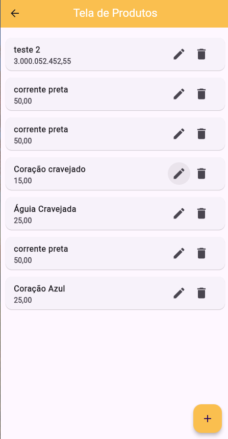
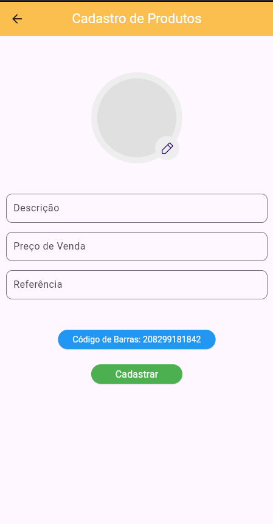

# Scanner App v1.0

## What is the Scanner App? 

The Scanner App is an application that helps you when registering jewelry.
With it, you insert the jewelry data into the application and it generates a code that can be
exported both when read by the App itself.

## General Observations

- This project is a Mobile App made in Dart using the Flutter framework.

- This is an interdisciplinary work done for college to solve a real problem we face.

# Portuguese - Brazil

## O que é o Scanner App?

O Scanner App é um aplicativo que auxilia na hora de cadastrar joias.
Com ele você insere os dados da joia no aplicativo e ele gera um código que pode ser
exportados ambos quando lidos pelo próprio App.

## Observações gerais
- Este projeto é um Mobile App feito em Dart utilizando o framework Flutter.

- Este é um trabalho interdisciplinar feito para a faculdade resolver um problema real que enfrentamos.

## Images

Home Page:

- Customer screen with registration and editing

- Product screen with registration and editing: 

- Sales screen with registration and editing: 

